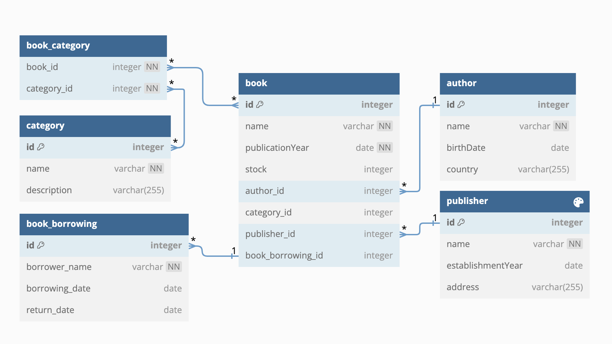

# Kütüphane Yönetim Sistemi

- Proje çalıştırmak için library_management_system.sql indirip postgesql restore et
- Bu proje Maven java ile dependency’leri tanımlayarak geliştirildi.
- Entity (varlık) sınıflarını ve bunların arasındaki ilişkileri kuruldu.
- Gerekli anotasyonları (@Entity, @Table, @Id, @OneToMany, @ManyToOne, @ManyToMany) yazıldı.
- Gerekli Fetch ve Cascade anotasyonlarını yazıldı.
- Veri tabanı olarak PostgreSQL kullanıldı.

### Bu kütüphane sisteminde aşağıdaki entity’ler bulunmaktadır.

- Kitap : Kitapların özelliklerini içeren entity/tablo.

- Yazar : Yazarların özelliklerini içeren entity/tablo.

- Kategori : Kitap kategorilerini içeren entity/tablo.

- Yayın Evi : Yayınevlerinin özelliklerini içeren entity/tablo.

- Kitap Ödünç Alınması : Kitap ödünç alma işlemlerini izleyen entity/tablo. Bu tablo, ödünç alınan kitabın kim tarafından alındığını, alınma tarihini ve teslim tarihini içermektedir.

## Bu varlıklar arasında şu ilişkileri şu şekildedir :

- Bir kitabın bir yazarı olabilir, bir yazarın birden fazla kitabı olabilir. (One-to-Many ilişkisi).

- Bir kategori birden fazla kitaba sahip olabilirken, bir kitap birden fazla kategoriye ait olabilir. (Many-to-Many ilişkisi).

- Bir kitabın bir yayınevi olabilir, bir yayınevinin birden fazla kitabı olabilir. (One-to-Many ilişkisi).

- Bir kitap birden fazla ödünç alma işlemine sahip olabilir, ancak her ödünç alma işlemi yalnızca bir kitaba ait olabilir. (One-to-Many ilişkisi).